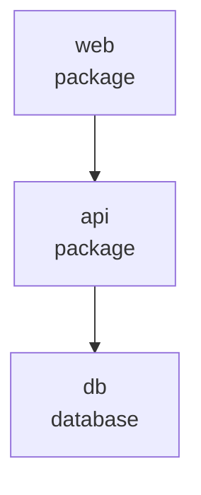

# Codebase Audit Report

Generated: 2026-05-18T00:00:00Z
Profile: `architecture`
Repository: `examples/multi-service`

## Architecture Findings

### Circular module dependency detected (`architecture-cycle-example`)

- Severity: medium
- Confidence: high
- Location: `services/api/src/feature-a.js`
- Evidence: `feature-a.js -> feature-b.js -> feature-a.js`
- Architecture impact: Circular imports increase initialization risk and make module boundaries harder to change.
- Recommended fix: Move shared contracts to a neutral module or invert one dependency.
- Estimated effort: medium
- Estimated ROI: high
- Verification: architecture review, focused tests around affected boundary

## Architecture Map

- Modules mapped: 5
- Local dependency edges: 4
- Circular dependency candidates: 1
- Services detected: 3
- Routes detected: 2

### Service Topology Diagram

